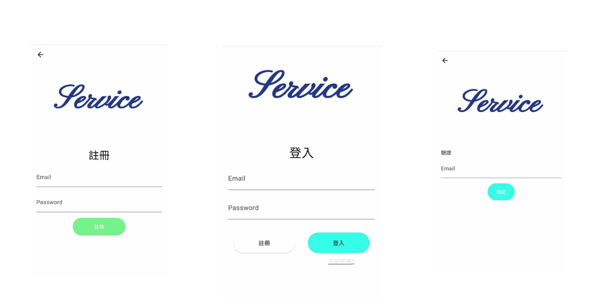
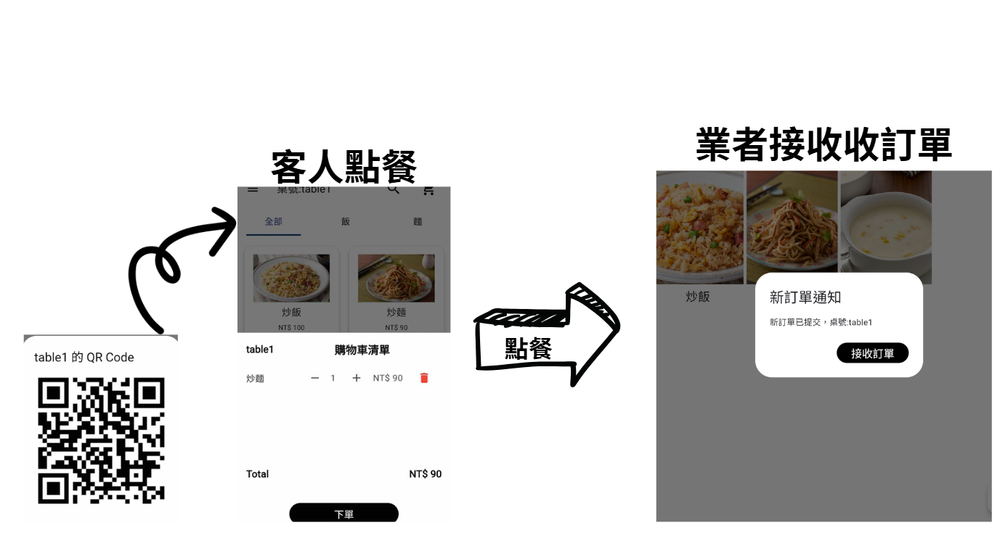
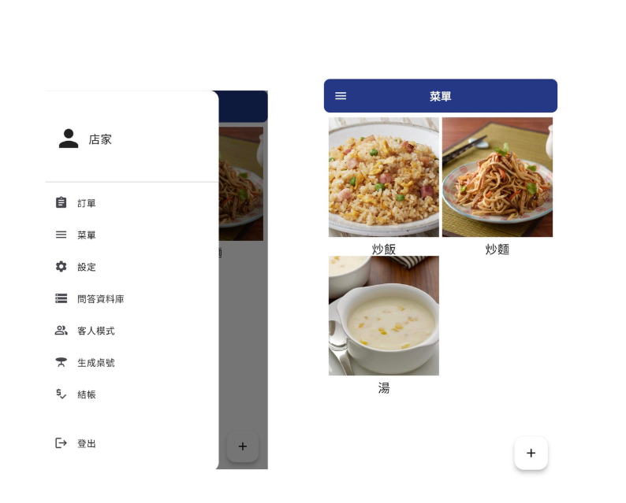
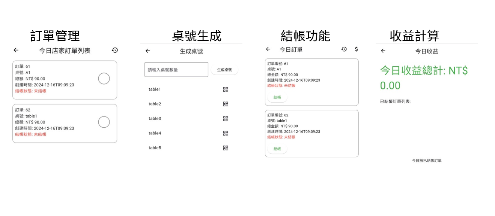
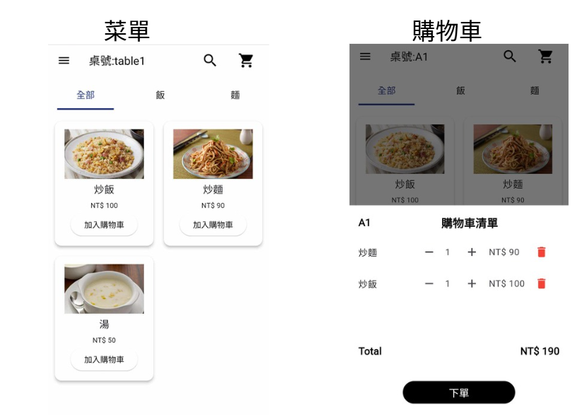

# Dining Service Web 

For the caterers

## Introduce 

In order to facilitate catering operators to manage orders and dynamically customize menus, customers can use QrCode to order food, simplify catering processes and reduce human resources.
# Authentications

# How to order?

# Caterers

# Client
